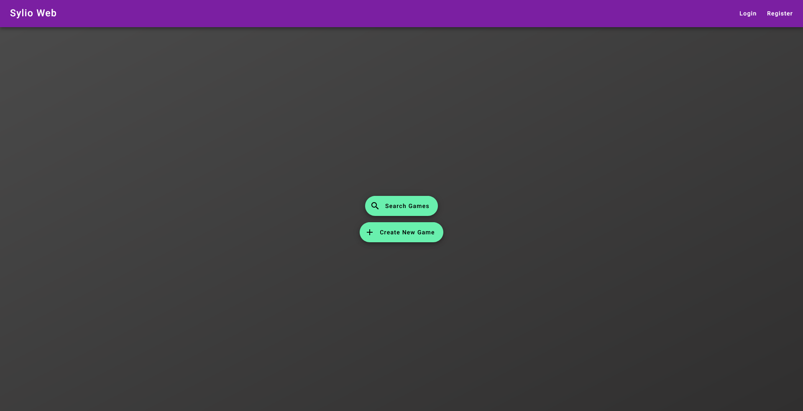
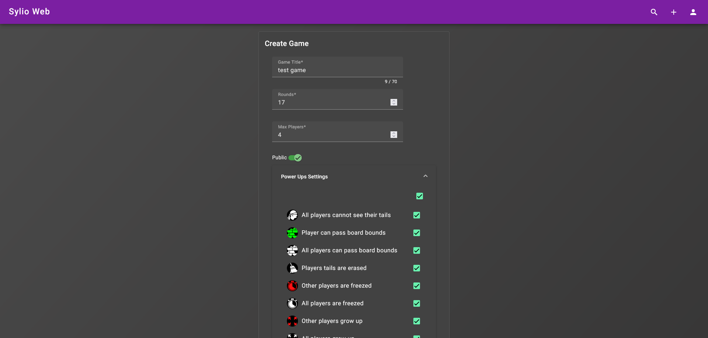
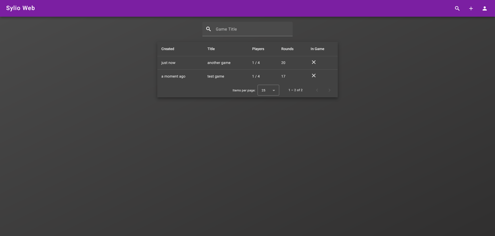
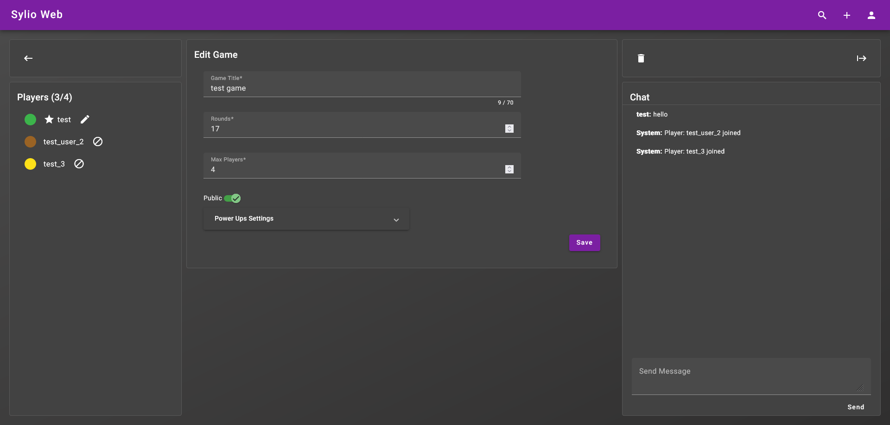
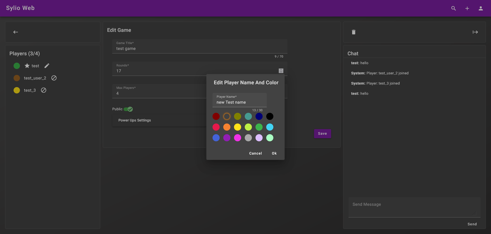
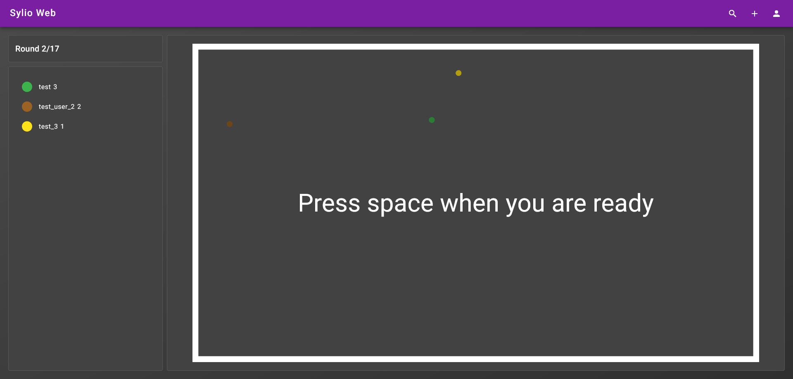
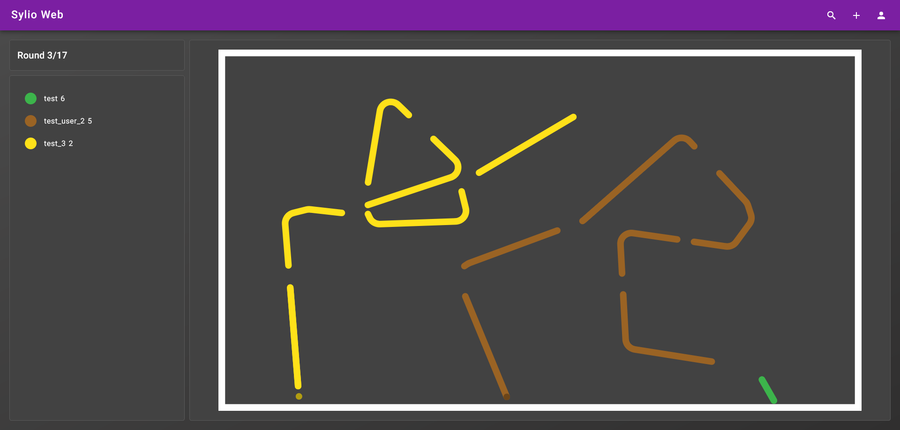
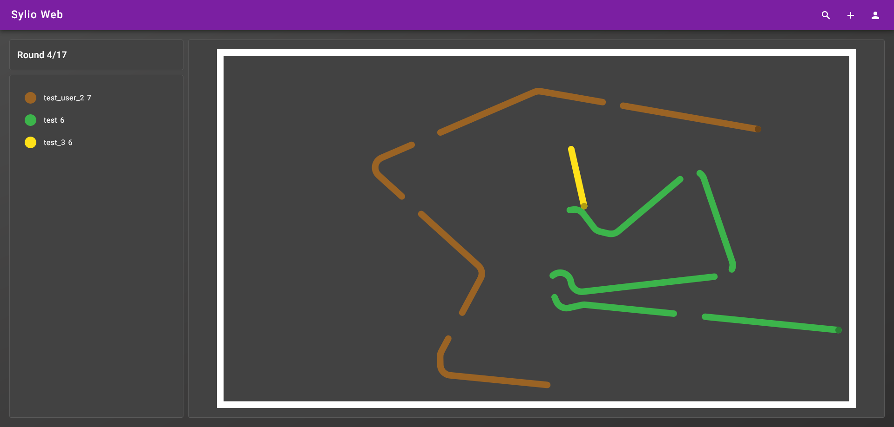

# Sylio-Web

Web version of this project
https://github.com/7bitcoder/Sylio

## Run local demo

### Requirements docker & docker-compose

- clone repository
- cd ./Docker/local-demo
- docker-compose up
- goto http://localhost:4200

## Screenshots

